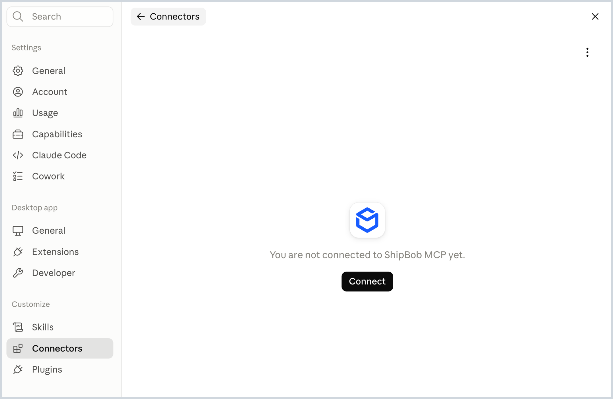
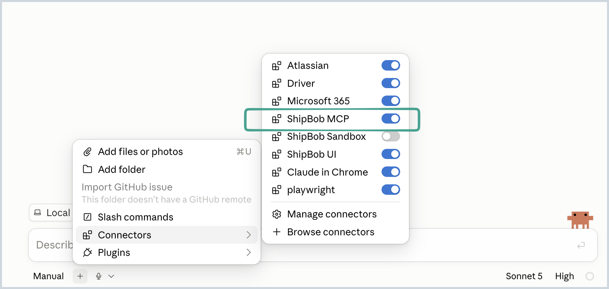

# Connect Claude Desktop to ShipBob

**What you'll learn**

How to connect Claude Desktop to your ShipBob account with a one-click connector, so Claude can see your live fulfillment data (orders, inventory, shipments, receiving) and take action on it.

**Prerequisites**

- Claude Desktop installed and signed in
- A ShipBob account

**Steps**

No prompt needed for this step, just a few clicks:

1. Open Claude Desktop and go to **Settings → Connectors**.
2. Search for **ShipBob** and select it.
3. Click **Connect**.

   

4. Sign in with your ShipBob account when prompted, then click **Authorize**.
5. ShipBob now shows as **Active** in your Connectors list.

Alternative: instead of searching for it inside Claude Desktop, you can connect directly from the [One-Click Official ShipBob Claude Connector](https://claude.ai/directory/connectors/b5a11013-f123-42e1-b553-1caa40c95477).

To confirm it worked, start a new chat and try:

```
What can ShipBob MCP do for me?
```

**What to expect**

Claude lists what it can access: typically orders, inventory levels, shipments, and receiving.

**Troubleshooting**

If it says it can't find anything, double check the connector shows **Active** under Settings → Connectors.



**Try it yourself**

Ask a real question about your account, like "How many orders shipped yesterday?" or "What's running low on inventory?"
