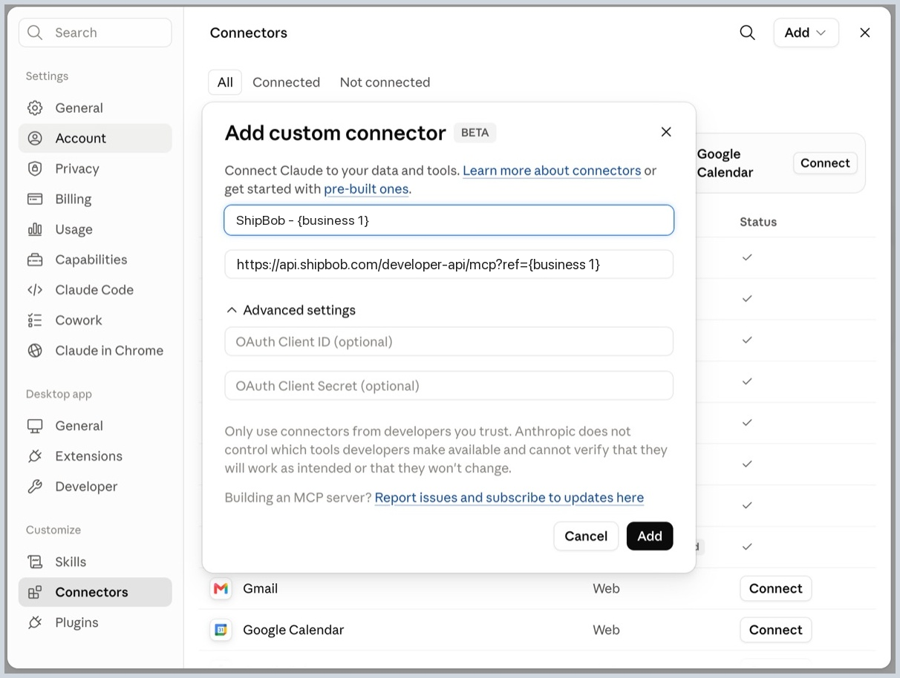
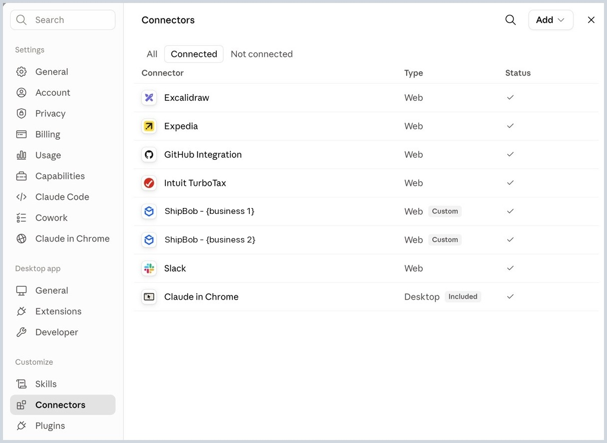

# Connecting Multiple Businesses

**What you'll learn**

If you run more than one business on ShipBob, each in its own ShipBob account, how to connect all of them so Claude can work across every business in the same conversation, with no switching accounts.

**Prerequisites**

- [Connect Claude Desktop](01_connect_claude_desktop.md) completed for your first business
- The additional ShipBob account(s), and the sign-in details for each

**The idea**

ShipBob's MCP endpoint is the same for every business:

```
https://api.shipbob.com/developer-api/mcp
```

Claude tells connectors apart by their URL, so adding a second business with that exact same URL won't work, it collides with the first one. The fix is to make each URL unique: add a `?ref=` query parameter, then name the connector after the business. From then on, Claude resolves which business you mean by matching your question to the connector's name, not its URL.

**Placeholders used below**

This guide uses one placeholder per business, `{business 1}` and `{business 2}`. Replace each with that business's name everywhere you see it, in the connector name and in the URL.

One rule when you substitute it into the URL: drop the spaces, since a URL can't contain them. So a business called `Apparel Inc` gives you the connector name `ShipBob - Apparel Inc` and the URL ending `?ref=apparelinc`. The ref value itself doesn't matter to ShipBob, it only has to be different for each business.

**Steps**

**Way 1: In Claude Desktop**

*Business 1*

1. Open Claude Desktop and go to **Settings → Connectors → Add → Add custom connector**.
2. In the name field, enter:

   ```
   ShipBob - {business 1}
   ```

3. In the URL field, paste:

   ```
   https://api.shipbob.com/developer-api/mcp?ref={business 1}
   ```

   

4. Leave OAuth Client ID and Client Secret blank, then click **Add**.
5. Sign in with business 1's ShipBob account when prompted, then click **Authorize**. The connector now shows as **Active**.

*Business 2*

Same five steps, with the business name swapped and one thing to watch.

6. Before you start, sign out of ShipBob in your browser, or open Claude's sign-in in a private window. This is the step people miss: if your browser still holds business 1's ShipBob session, the sign-in is skipped silently and business 2's connector ends up pointing at business 1's data.
7. Go to **Settings → Connectors → Add → Add custom connector** again.
8. In the name field, enter:

   ```
   ShipBob - {business 2}
   ```

9. In the URL field, paste:

   ```
   https://api.shipbob.com/developer-api/mcp?ref={business 2}
   ```

10. Leave the OAuth fields blank, click **Add**, then sign in with **business 2's** ShipBob account and click **Authorize**.

Both now sit in your Connectors list as separate Custom connectors, live at the same time:



Repeat the same pattern for a third or fourth business, with a different name and a different ref each time.

**Way 2: With a config file (Claude Code or any MCP agent)**

Add one server entry per business, each with its own ref and its own ShipBob personal access token (PAT):

```
{
  "mcpServers": {
    "shipbob-{business 1}": {
      "type": "http",
      "url": "https://api.shipbob.com/developer-api/mcp?ref={business 1}",
      "headers": { "Authorization": "Bearer <business 1 shipbob_pat_token>" }
    },
    "shipbob-{business 2}": {
      "type": "http",
      "url": "https://api.shipbob.com/developer-api/mcp?ref={business 2}",
      "headers": { "Authorization": "Bearer <business 2 shipbob_pat_token>" }
    }
  }
}
```

Each business needs its own personal access token, generated while signed into that business's ShipBob account. The server key (e.g. `shipbob-{business 1}`) is what the agent shows when it routes a call, so name it after the business too.

**Verify it worked**

Start a new chat and ask a question that touches both businesses:

```
List my connected ShipBob accounts and, for each one, how many orders are pending fulfillment.
```

You should see Claude call both connectors by name and return two separate sets of numbers. If both come back identical, see Troubleshooting below.

**What to expect**

Claude matches your question to the right connector by name. Ask about "my {business 2} account," and it reaches for **ShipBob - {business 2}**. Ask about {business 1} in the very same conversation, and it switches to **ShipBob - {business 1}**, no reconnecting needed.

When asking Claude something, say which business you mean if it's not obvious:

```
Using my {business 1} account, how many orders are pending fulfillment?
```

**Troubleshooting**

- **Both connectors return the same data.** The second sign-in reused the first business's browser session. Remove the second connector, sign out of ShipBob in your browser (or use a private window), then add it again.
- **Claude says the connector already exists, or the second one won't add.** The two URLs aren't unique. Check that the `?ref=` value is genuinely different between the two connectors.
- **A connector isn't showing as Active.** Open **Settings → Connectors** and confirm its status, the same check as in [Connect Claude Desktop](01_connect_claude_desktop.md).
- **Claude picks the wrong business.** Name the business explicitly in your question, and make sure the connector names are distinct enough to tell apart.

**Try it yourself**

Ask a question that compares both businesses, like "Compare pending order counts between {business 1} and {business 2}."
