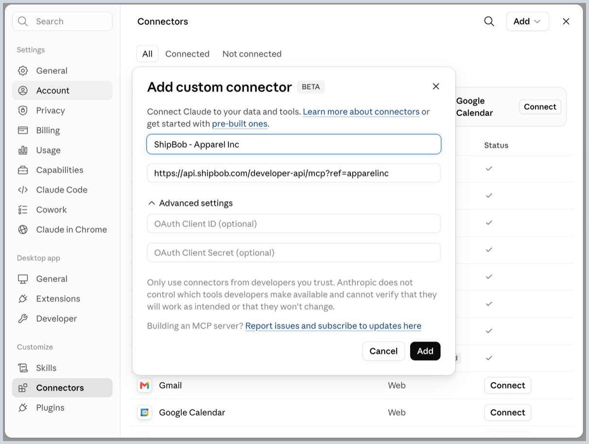
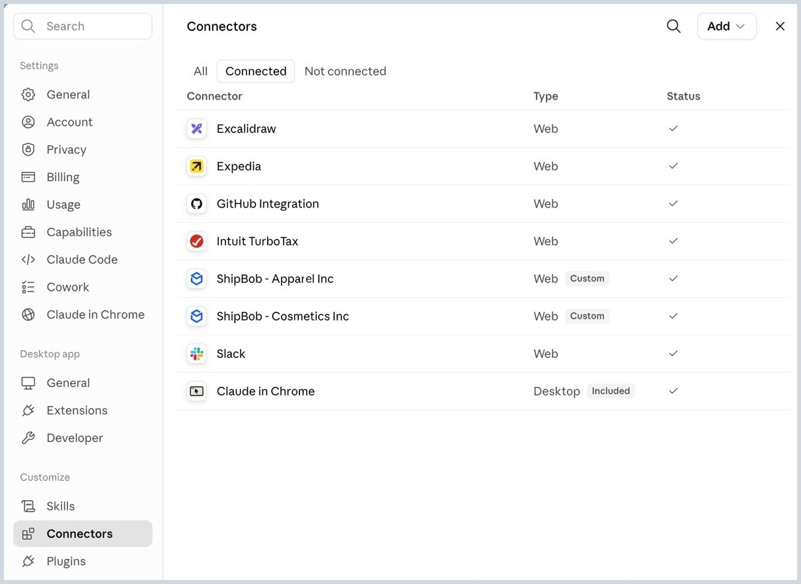

# Connecting Multiple Businesses

**What you'll learn**

If you run more than one business on ShipBob, each in its own ShipBob account, how to connect all of them so Claude can work across every business in the same conversation, with no switching accounts.

**Prerequisites**

- [Connect Claude Desktop](01_connect_claude_desktop.md) completed for your first business
- The additional ShipBob account(s)

**The idea**

ShipBob's MCP endpoint is the same for every business: `https://api.shipbob.com/developer-api/mcp`. Claude tells connectors apart by their URL, so adding a second business with that exact same URL won't work, it collides with the first one. The fix is to make each URL unique: add a `?ref=<business>` query parameter, then name the connector after the business (e.g. **ShipBob - Apparel Inc**). From then on, Claude resolves which business you mean by matching your question to the connector's name, not its URL.

**Steps**

**Way 1: In Claude Desktop**

1. Go to **Settings → Connectors → Add → Add custom connector**.
2. Name it after the business, e.g. **ShipBob - Apparel Inc**.
3. Paste the URL with a unique ref, e.g. `https://api.shipbob.com/developer-api/mcp?ref=apparelinc`.

   

4. Leave OAuth Client ID / Secret blank, click **Add**, then finish the ShipBob sign-in for that account.
5. Repeat for each additional business, with a different name and a different ref each time, e.g. **ShipBob - Cosmetics Inc**, `?ref=cosmeticsinc`.



**Way 2: With a config file (Claude Code or any MCP agent)**

Add one server entry per business, each with its own ref and its own ShipBob personal access token (PAT):

```
{
  "mcpServers": {
    "shipbob-apparel-inc": {
      "type": "http",
      "url": "https://api.shipbob.com/developer-api/mcp?ref=apparelinc",
      "headers": { "Authorization": "Bearer <shipbob_pat_token>" }
    },
    "shipbob-cosmetics-inc": {
      "type": "http",
      "url": "https://api.shipbob.com/developer-api/mcp?ref=cosmeticsinc",
      "headers": { "Authorization": "Bearer <shipbob_pat_token>" }
    }
  }
}
```

Swap `<shipbob_pat_token>` for each account's own ShipBob personal access token. The server key (e.g. `shipbob-apparel-inc`) is what the agent shows when it routes a call, so name it after the business too.

When asking Claude something, say which business you mean if it's not obvious:

```
Using my Apparel Inc account, how many orders are pending fulfillment?
```

**What to expect**

Claude matches your question to the right connector by name. Ask about "my cosmetics business," and it reaches for **ShipBob - Cosmetics Inc**. Ask about apparel in the very same conversation, and it switches to **ShipBob - Apparel Inc**, no reconnecting needed.

**Try it yourself**

Ask a question that compares both businesses, like "Compare pending order counts between Apparel Inc and Cosmetics Inc."
