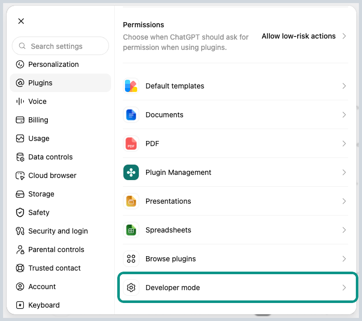
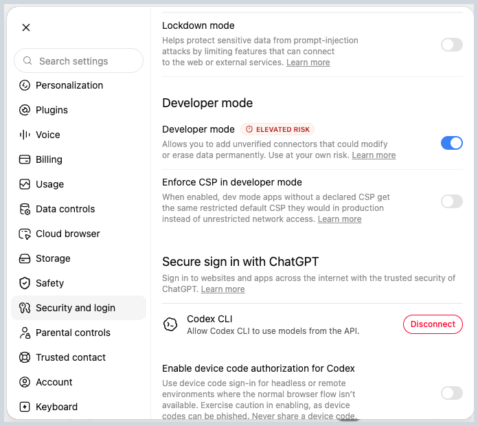
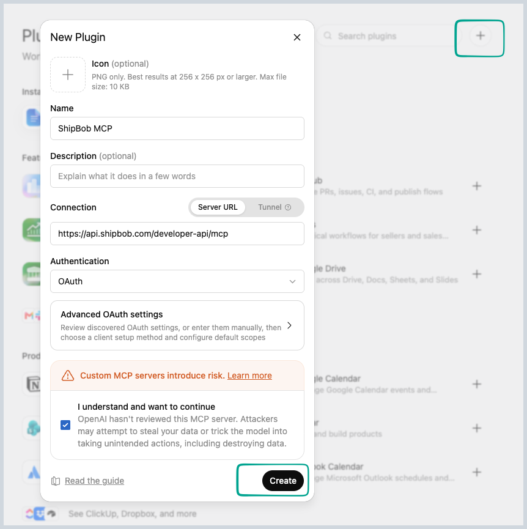
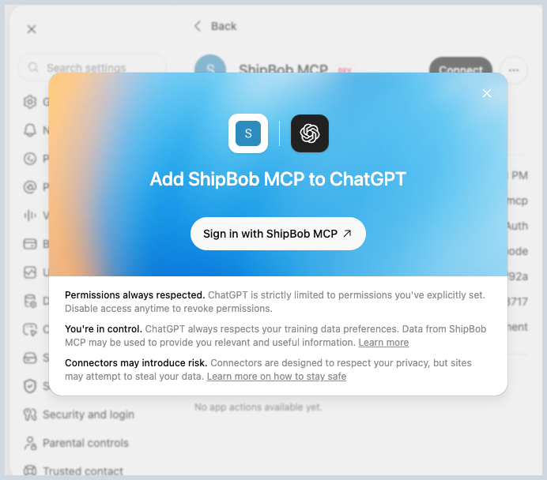

# Connect ChatGPT to ShipBob

**What you'll learn**

How to connect ChatGPT to your ShipBob account as a custom connector, so ChatGPT can see your live fulfillment data (orders, inventory, shipments, receiving) and take action on it.

**Prerequisites**

- A ChatGPT Plus, Team, or Enterprise account
- A ShipBob account

**Steps**

ShipBob MCP is still going through OpenAI's plugin verification process, so for now you add it to ChatGPT as a custom plugin rather than a listed one. Here's how:

1. Open ChatGPT and go to **Settings → Plugins**, then click **Developer mode**.

   

2. Toggle **Developer mode** on, then save.

   

3. Go back to **Plugins** and click the **+** in the top right to open the **New Plugin** dialog, then fill it in:
   - **Name**: `ShipBob MCP`
   - **Connection**: Server URL, `https://api.shipbob.com/developer-api/mcp`
   - **Authentication**: `OAuth`
   - Check **I understand and want to continue**, then click **Create**.

   

4. Click **Sign in with ShipBob MCP**, then sign in with your ShipBob account when prompted and click **Authorize**.

   

To confirm it worked, start a new chat and try:

```
What can ShipBob MCP do for me?
```

**What to expect**

ChatGPT lists what it can access: typically orders, inventory levels, shipments, and receiving.

**Try it yourself**

Ask a real question about your account, like "How many orders shipped yesterday?" or "What's running low on inventory?"
