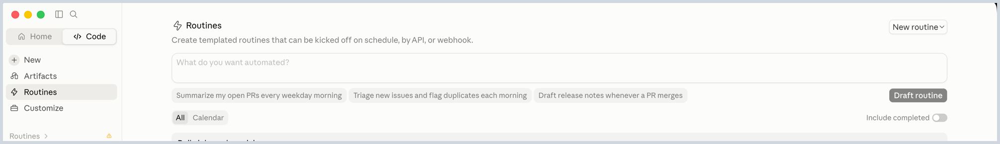

# Automated Inbound Reports with Claude Routines

**What you'll learn**

How to get a daily inbound receiving report delivered automatically using Claude Routines, no Slack required.

**Prerequisites**

- [Connect Claude Desktop](../00_getting_started/01_connect_claude_desktop.md) completed

**The prompt**

In Claude Desktop, go to **Routines** in the sidebar, then paste this into the "What do you want automated?" box:



```
Set up a routine that runs every day at 8am CT. Summarize the last 48 hours of inbound receiving activity using the ShipBob MCP, plus all currently pending receiving orders. Use this format:

Received (in last 48 hours)
[Table] WRO # | PO | SKU | Quantity Expected | Received | Stowed | Summary

{Summary should include "No discrepancies" or "x units short" or "x units over received"}

Pending (All)
[Table] WRO # | PO | SKU | Quantity Expected | Status

Overall summary
{2-3 sentence summary of inbound health}
```

**What to expect**

Claude creates a routine that runs on the schedule you gave it, without you needing to open Claude Desktop and ask each time. You'll see the routine listed under your scheduled routines, and can edit or delete it the same way.

You can extend this further: connect an email or Slack MCP, and the same routine can deliver the report straight to your inbox or a Slack channel instead of just sitting in your routines list.

**Try it yourself**

Compare this to the Claude Tag + Slack version up next: which one fits your team better, a routine that reaches you directly, or a report that posts where your team already collaborates?
